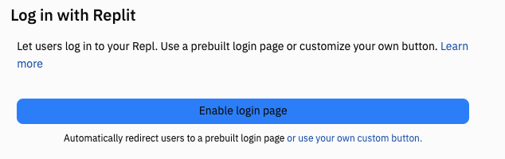
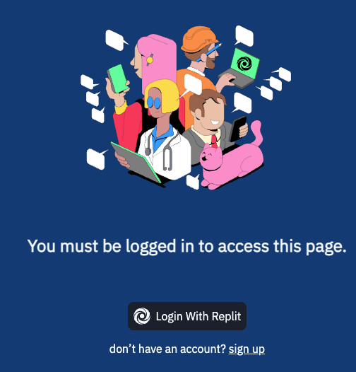

# Authentication

Efficient code often has the drawback of being very hard to understand at first.  It's often very dense, with lots of things happening on a single line of code.

That's why teachers often teach what could be described as 'the long way round' when designing lessons on new topics. 

With all that in mind, don't be mad at us when we say that *there is an easier way* to create a login system than by using sessions.  You've spent the past few days getting a really thorough grounding in what's going on behind the scenes, which was the whole point. No, really. We promise. 


## Replit Authentication

Here at Replit, we know that you will probably be using authentication **a lot**. So we've baked in the feature for you.

👉 Run your code, then head over to your left hand files pane and scroll until you see *authentication*. Then, erm, turn it on.  That's it.



Now you will see that your repl uses the default Replit login page.


I can also access a bunch of information about the user stored in the authentication panel. 

👉 To do this I'm going to import `request`, and then use `username = request.headers["X-Replit-User-Name"]` to assign the username to a variable.  I got the `X-Replit-User-Name` code from the authentication panel.

Here's the full code:

```python
from flask import Flask, request

app = Flask(__name__)

@app.route('/')
def index():
  username = request.headers["X-Replit-User-Name"]
  return f"Hello {username}"

app.run(host='0.0.0.0', port=81)
```
## Try it out!